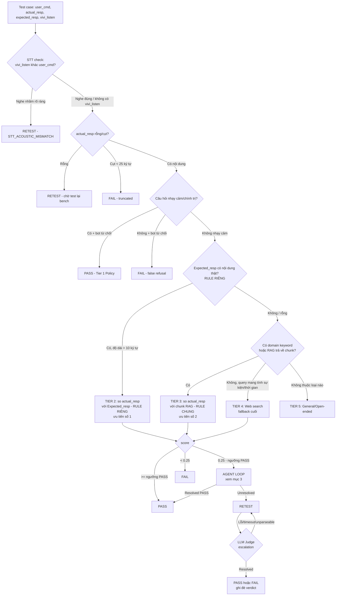

# Đặc tả Luồng Judge, Tool-Calling, Agent Loop & Hệ thống Severity

Tài liệu này mô tả **chính xác theo code hiện tại** (không phải mô tả lý tưởng/marketing) cách hệ thống chấm điểm ra quyết định, gọi tool theo thứ tự nào, Agent Loop hoạt động ra sao, và cách phân loại mức độ nghiêm trọng.

---

## 1. Luồng Judge: Rule Riêng vs Rule Chung



**Rule Riêng** (Tier 2, `EXPLICIT_SPEC`): cột `Expected_resp` trong file test — do người viết test case tự điền, luôn được ưu tiên số 1 vì đây là đáp án chính xác nhất cho đúng câu hỏi cụ thể đó.

**Rule Chung** (Tier 3, `DOMAIN_RULE_SPEC`): dữ liệu trong ChromaDB (Owner Manual + Command List) — chỉ được dùng khi Rule Riêng không có, vì đây là tài liệu tổng quát, có thể chứa nhiều chủ đề không khớp 100% với câu hỏi cụ thể (đây cũng là nguyên nhân của giới hạn đã ghi trong `PROJECT_DOCUMENTATION.md` §8.2 — so với cả đoạn dài đôi khi không công bằng).

Code tương ứng: `src/eval_router.py::AdaptiveEvalRouter.classify_test_type()` (dòng phân loại Tier) và `evaluate()` (dòng routing thực thi).

---

## 2. Luồng Tool-Calling — thứ tự gọi thực tế

Mỗi lần `router.evaluate()` chạy, các tool sau **có thể** được gọi (không phải lúc nào cũng gọi hết — tùy nhánh):

| # | Tool | File | Khi nào được gọi |
|---|---|---|---|
| 1 | `compute_text_overlap_similarity()` | eval_tools.py | Luôn — bước đầu tiên, check STT |
| 2 | `extract_relevant_sentence()` | eval_tools.py | Để build `rule_info` hiển thị (không dùng để tính điểm) |
| 3 | `rag_spec_search()` | eval_tools.py | Actual rỗng/cụt, hoặc Tier owner_manual |
| 4 | `rag_rule_search()` | eval_tools.py | Tier domain/command_rule/thuongthuc |
| 5 | `web_search_verification()` | eval_tools.py | Actual rỗng + không có RAG match; hoặc Tier 4 |
| 6 | `compute_similarity()` | eval_tools.py | Tier 2/3/4 — chấm điểm chính |
| 7 | **`AgentEvalLoop.run_correction_loop()`** | agent_loop.py | **Score rơi vào [0.25, ngưỡng PASS)** — xem mục 3 |
| 8 | `compute_semantic_diff()` | eval_trace.py | Khi verdict là FAIL/RETEST và có expected_resp |
| 9 | `llm_judge.run_judge()` | llm_judge.py | Khi verdict cuối là RETEST (không phải STT/rỗng) và có nội dung tham chiếu |
| 10 | `generate_trace_log()` | eval_trace.py | Luôn — bước cuối, mọi verdict đều qua đây |

**Quan trọng nhất theo yêu cầu của bạn — LOOP (#7)** — chi tiết ở mục 3 dưới.

---

## 3. AGENT LOOP — cấu tạo chi tiết (`src/agent_loop.py`)

### 3.1 Định nghĩa

```python
class AgentEvalLoop:
    def __init__(self, max_iterations: int = 2):
        self.max_iterations = max_iterations

    def run_correction_loop(self, user_cmd, actual_resp, initial_score) -> dict:
        ...
```

Đây **không phải** một vòng lặp tự sinh nhiều bước bất định (không phải ReAct loop) — nó là **2 bước cố định, tuần tự, có điều kiện dừng sớm**:

```
Bước 1 (RAG Expansion):
  query mở rộng = "{user_cmd} thông số tính năng vận hành hướng dẫn"
  → gọi rag_rule_search(query mở rộng, top_k=2)
  → nếu có chunk: score_1 = compute_similarity(actual_resp, chunk[0].content, user_cmd)
                              [tính trên FULL text chunk, không cắt ngắn]
  → NẾU score_1 >= RAG_PASS_THRESHOLD (0.45):
        DỪNG NGAY, trả về resolved=True, verdict=PASS, score=score_1*100
        (không chạy Bước 2)

Bước 2 (Web Search Fallback) — CHỈ chạy nếu Bước 1 không resolve VÀ iterations_run < max_iterations(2):
  → gọi web_search_verification(user_cmd, max_results=2)
  → nếu có kết quả: score_2 = compute_similarity(actual_resp, combined_snippets, user_cmd)
                                [combined_snippets = full_snippet của TẤT CẢ kết quả web, nối bằng " "]
  → NẾU score_2 >= WEB_PASS_THRESHOLD (0.50 — ngưỡng CAO HƠN vì nguồn web
                                        không được kiểm soát chất lượng như RAG nội bộ):
        DỪNG, trả về resolved=True, verdict=PASS,
        score = max(75.0, score_2*100)   [sàn 75 vì đã pass ngưỡng web]

Nếu cả 2 bước đều không đạt ngưỡng:
  → trả về resolved=False, verdict=RETEST, score=initial_score*100 (giữ nguyên điểm ban đầu)
```

### 3.2 Điểm quan trọng cần lưu ý khi review

1. **Loop này chỉ có thể trả về PASS hoặc "không resolve" (RETEST)** — nó **không bao giờ tự trả về FAIL**. Nếu không tìm được bằng chứng ủng hộ, nó luôn RETEST (an toàn — không tự ý kết luận sai).
2. **Loop được gọi lại từ 4 vị trí khác nhau** trong `eval_router.py`, mỗi lần tạo **instance loop_res riêng**, không chia sẻ trạng thái:
   - Tier 2 (Explicit Spec) borderline
   - Tier 3 (Domain RAG) borderline
   - Tier 4 (Web Fact) borderline
   - Tier 5 fallback cuối cùng — **gọi với `initial_score` cố định = 0.30** (không phải điểm thật, vì Tier 5 không có sim_score thật để truyền vào, do đây là câu hỏi mở không có gì để so sánh ban đầu)
3. `self.agent_loop = AgentEvalLoop(max_iterations=2)` được khởi tạo **1 lần duy nhất** trong `__init__` của `AdaptiveEvalRouter` — dùng chung cho toàn bộ các lần gọi `evaluate()` của cùng 1 router instance (không tạo mới mỗi request, trừ trường hợp `/api/eval/single` tạo router mới mỗi request — xem PROJECT_DOCUMENTATION.md §8.1 phần liên quan).
4. **Không có rebuttal/retry trong cùng 1 bước** — mỗi bước chỉ thử 1 lần, không lặp lại nếu RAG/web trả về lỗi (lỗi được ghi vào `rag_error`/`web_error` rồi bỏ qua, chuyển tiếp).

### 3.3 Độ trễ của Loop
- Bước 1 (RAG): ~10-50ms (query vector store local, không qua mạng)
- Bước 2 (Web): timeout cứng 2 giây (`DDGS(timeout=2)`) — nếu mạng chậm/lỗi, tốn tối đa 2s rồi bỏ qua
- Tổng tối đa nếu cả 2 bước đều chạy: ~2.05 giây/case

---

## 4. AGENT BENCHMARK — cấu tạo chi tiết (`src/agent_benchmark.py`)

### 4.1 Dữ liệu test

`get_real_ground_truth_testset()` — **108 case tổng hợp thủ công** (không phải dữ liệu thật từ bench xe), chia đều **6 nhóm × 18 case**:

| Nhóm | Mục đích kiểm tra | Verdict kỳ vọng |
|---|---|---|
| Explicit Spec | Tier 2 hoạt động đúng khi có Expected_resp rõ ràng | PASS |
| Domain RAG Match | Tier 3 khớp đúng với thông số kỹ thuật xe | PASS |
| Borderline 0.25-0.45 | Agent Loop có resolve đúng câu hỏi cung hoàng đạo/địa danh không (RAG/web) | PASS |
| STT Mismatch | Bot nghe nhầm wake-word có bị gắn RETEST đúng không | RETEST |
| False Refusal | Bot từ chối câu hỏi hợp lệ có bị FAIL đúng không | FAIL |
| Tier 5 Open-Ended | Câu hỏi trò chuyện chung có PASS qua Agent Loop không | PASS |

### 4.2 Cách chạy & đo

```python
class AgentBenchmarkSuite:
    def __init__(self):
        self.router = AdaptiveEvalRouter()   # 1 router dùng chung cho cả 108 case

    def run_benchmark(self, sample_cases=None):
        # Chạy TUẦN TỰ từng case qua router.evaluate() — KHÔNG song song (không dùng ThreadPoolExecutor)
        # Ghi lại: verdict thật vs verdict kỳ vọng, resolved_by, slice
        # Tính: accuracy, confusion matrix, false_pass_rate, false_reject_rate,
        #        path_breakdown (theo resolved_by), slice_breakdown (theo nhóm),
        #        throughput (rows/sec), average_latency (ms/row)
```

`compute_confusion_matrix()`:
- **False Pass (FP)**: verdict = PASS nhưng ground truth ≠ PASS → nguy hiểm nhất (bỏ sót lỗi thật)
- **False Reject (FN)**: verdict ≠ PASS nhưng ground truth = PASS → gây phiền (báo lỗi oan)

### 4.3 Điểm cần lưu ý khi review

1. **Đây là dữ liệu tổng hợp, KHÔNG phải dữ liệu thật** — dùng để kiểm tra logic routing/loop có hoạt động đúng ý thiết kế không, **không phản ánh độ chính xác thật trên dữ liệu sản xuất** (đã chứng minh trong phiên làm việc: benchmark báo ~74%, nhưng khi chạy trên ~1.800-2.500 dòng dữ liệu thật thì kết quả khác hẳn, chủ yếu vì nhiễu nhãn của con người, không phải vì thuật toán sai — xem `PROJECT_DOCUMENTATION.md` §8.3).
2. **Chạy tuần tự (không song song)** — vì mục đích là benchmark chính xác/tốc độ đơn luồng, không phải benchmark thông lượng batch thật. Trong sản xuất thật, `excel_evaluator.py` dùng 16 worker song song, benchmark này KHÔNG đo được throughput thật của batch.
3. **Không kiểm tra riêng LLM Judge (`llm_judge.py`)** — benchmark này được viết trước khi LLM Judge tồn tại, chưa cập nhật để đo tác động của bước escalation mới.
4. Thời gian chạy phụ thuộc mạng thật (DDGS) cho các case Borderline/Tier5 cần web fallback — không ổn định 100% giữa các lần chạy.

---

## 5. Hệ thống 3 mức độ Severity (HIGH / MEDIUM / LOW / PASS)

Code: `src/eval_trace.py::classify_severity()`

```python
def classify_severity(auto_result, sim_score, is_stt_mismatch, is_false_refusal):
    if auto_result == "PASS" and sim_score >= 0.85:
        return "PASS"
    if is_stt_mismatch:
        return "LOW"          # lỗi âm thanh, không phải lỗi logic bot
    if is_false_refusal or sim_score < 0.40:
        return "HIGH"
    if sim_score < 0.70:
        return "MEDIUM"
    return "LOW"
```

### Bảng % sai tương ứng

`semantic_error_pct = (1.0 - sim_score) × 100%`

| Mức | Điều kiện sim_score | % SAI tương ứng | Ý nghĩa | Ví dụ lỗi |
|---|---|---|---|---|
| ✅ **PASS** | `auto_result=PASS` và `score ≥ 85%` | 0% - 15% | Đúng, đầy đủ, có căn cứ | Trả lời đúng thông số, đúng nội dung |
| ℹ️ **LOW** | `score ≥ 70%` (hoặc STT mismatch bất kể % nào) | 15.1% - 30% (hoặc N/A nếu STT) | Sai nhỏ về diễn đạt, hoặc lỗi âm thanh không phải lỗi bot | Diễn giải khác chút ít nhưng đúng ý; hoặc nghe nhầm wake-word |
| ⚠️ **MEDIUM** | `40% ≤ score < 70%` | 30.1% - 60% | Thiếu bước/chi tiết quan trọng | Trả lời đúng hướng nhưng thiếu thông tin |
| 🚨 **HIGH** | `score < 40%` HOẶC từ chối sai (false refusal) | 60.1% - 100% | Sai nghiêm trọng, sai sự thật, hoặc từ chối câu hỏi hợp lệ | Bịa thông tin, từ chối trả lời câu hỏi đúng phạm vi |

**Lưu ý quan trọng**: một case có `auto_result=PASS` nhưng `score` trong khoảng 70-84% (ví dụ PASS qua Tier 3/4 với sàn điểm 75, hoặc PASS qua LLM Judge với `score=80`) sẽ nhận **severity=LOW**, không phải PASS — đây là hành vi **có chủ đích** (đã kiểm chứng trong phiên làm việc), không phải bug: verdict đúng nhưng độ tin cậy về mặt từ vựng chưa tuyệt đối, nên severity phản ánh mức độ cần chú ý thấp hơn PASS hoàn hảo.

---

## 6. "Sai ngữ nghĩa như thế nào" — Traceability về log

### 6.1 `compute_semantic_diff()` — chỉ ra từ nào thiếu

Chạy khi verdict là FAIL/RETEST và có `expected_resp`:

```python
exp_words = tách từ có nghĩa (bỏ stopword) từ expected_resp
act_words = tách từ có nghĩa (bỏ stopword) từ actual_resp
missing   = exp_words không xuất hiện trong act_words
coverage% = (số từ trùng / tổng từ expected) × 100
```

Kết quả được nối thẳng vào cột `Root_Cause_Analysis`:
`"... [Semantic Diff Failure: Actual response is missing critical key terms from expected spec: ['dây', 'an', 'toàn', 'thắt']. Match coverage: 25.3%.]"`

**Giới hạn đã ghi nhận**: hàm này không phân biệt được "từ khóa quan trọng" với "từ chào hỏi/tiêu đề chung chung" — đôi khi liệt kê nhầm các từ như "giới", "thiệu", "chúc", "mừng" là "từ khóa quan trọng bị thiếu" khi expected_resp là đoạn giới thiệu chung (xem `PROJECT_DOCUMENTATION.md` §8.2).

### 6.2 `trace_id` và `trace_log` — trace ngược đầy đủ

**Có** — mọi case đều có 1 `trace_id` duy nhất (`tr-{timestamp}-{uuid6hex}`) và 1 object `trace_log` đầy đủ chứa:

| Trường | Ý nghĩa |
|---|---|
| `trace_id` | ID duy nhất để tra cứu |
| `system_version`, `embedding_model`, `prompt_template_version`, `vector_db_version` | Phiên bản hệ thống tại thời điểm chấm — để biết case này chấm bằng logic/model nào |
| `sim_score`, `semantic_error_pct`, `severity`, `error_category` | Điểm số và phân loại |
| `semantic_diff` | Kết quả mục 6.1 |
| `resolved_by` | **Chuỗi này trả lời trực tiếp "sai/đúng nhờ đâu"**: `"Explicit Spec"` / `"RAG Vector DB"` / `"Web Fact Verification"` / `"Agent Loop Iteration 1 (RAG Search)"` / `"Agent Loop Iteration 2 (Live Web Search)"` |
| `resolving_source`, `resolving_url`, `resolving_snippet` | Chunk/URL cụ thể nào đã được dùng để ra quyết định — trace được tận nguồn |
| `web_error`, `rag_error` | Nếu RAG/web bị lỗi khi cố resolve, lỗi gì (network timeout, circuit breaker mở, v.v.) |
| `retrieved_chunks` | Toàn bộ danh sách chunk RAG đã lấy được (không chỉ chunk được chọn) |
| `rca`, `rule_info` | Text giải thích do hệ thống sinh ra + nội dung rule/spec đã so khớp |

**Cách xem trong thực tế**:
- Trên dashboard: click vào bất kỳ dòng nào trong bảng kết quả → modal "Evaluation Trace Log" hiện toàn bộ JSON trace ở trên (đã code sẵn trong `static/js/app.js::showTraceModal()`).
- Qua API: field `trace_log` trong response của `/api/eval/single` hoặc trong `results[].trace_log` của `/api/eval/progress/{task_id}`.
- Qua Excel: cột `Root_Cause_Analysis` chứa bản tóm tắt readable, nhưng **không chứa trace_log đầy đủ** (trace_log đầy đủ chỉ có trong response batch web JSON, không được ghi vào file Excel export hiện tại — đây là điểm bạn có thể muốn bổ sung nếu cần audit từ file Excel).

---

## 7. Độ Realtime / Delay

Số liệu đo thật trong phiên làm việc (CPU only, không GPU, HuggingFace embedding local `all-MiniLM-L6-v2`):

| Thao tác | Độ trễ thật | Ghi chú |
|---|---|---|
| Tier 1/2 không borderline (regex + compute_similarity) | < 5ms | Không I/O, thuần CPU string processing |
| 1 lần `rag_rule_search`/`rag_spec_search` | ~10-50ms | Embedding query + Chroma similarity search local |
| 1 lần `web_search_verification` | ≤ 2000ms (timeout cứng) | DuckDuckGo, phụ thuộc mạng, có cache + circuit breaker |
| Agent Loop đầy đủ (2 bước, cả RAG lẫn web) | ~50ms - 2.05s | Tùy có cần bước 2 (web) hay dừng ở bước 1 (RAG) |
| **1 lần gọi `llm_judge.run_judge()`** | **~4.6 giây trung bình** | 1 lệnh gọi Ollama `qwen2.5:3b` local, CPU-only |
| Batch 1.792 dòng, KHÔNG có RETEST cần judge | ~50-135 giây | Đo thật với 16 worker song song |
| **Batch 1.792 dòng, CÓ ~117 case cần LLM Judge** | **306.8 giây (~5.1 phút)** | Đo thật, 16 worker song song, đã bao gồm cả judge escalation |

**Kết luận về realtime**:
- Chấm 1 case đơn lẻ qua Tier 1-4 (không cần Loop/Judge): **thực tế gần như tức thời** (< 100ms).
- Chấm 1 case cần Agent Loop nhưng không cần web: vẫn **rất nhanh** (~50ms).
- Chấm 1 case cần web fallback: cộng thêm tối đa 2s (do timeout cứng).
- Chấm 1 case rơi vào RETEST cần LLM Judge: **~4.6s/case** — đây là điểm nghẽn tốc độ chính của toàn hệ thống, nhưng vì chỉ áp dụng cho phần nhỏ RETEST (~6-10% tổng số dòng thực tế), tổng thời gian batch cho 1 file ~1.500-2.000 dòng vẫn trong khoảng **~5 phút**, chấp nhận được cho việc chạy thường xuyên.
- Batch API qua dashboard (`web_server.py`) hiện **không song song hóa** (khác với CLI) — cùng 1 file sẽ chạy chậm hơn đáng kể qua dashboard so với qua CLI (`ExcelTestEvaluator.evaluate_file()` trực tiếp) — đây là vấn đề đã ghi nhận, chưa sửa.

---

## Tóm tắt để bạn review nhanh

1. **Rule Riêng > Rule Chung**: Expected_resp (nếu có) luôn được ưu tiên so sánh trước vector DB.
2. **Loop chỉ có 2 bước cố định** (RAG rồi Web), không phải vòng lặp mở, không bao giờ tự FAIL, chỉ PASS hoặc RETEST.
3. **Benchmark dùng dữ liệu giả lập 108 case**, không phản ánh chính xác thật trên dữ liệu sản xuất — cần chạy riêng trên file thật để biết số liệu thật.
4. **3 mức HIGH/MEDIUM/LOW** map trực tiếp theo % sai: HIGH >60%, MEDIUM 30-60%, LOW 15-30%, PASS <15%.
5. **Trace ngược được đầy đủ** qua `trace_id` + `trace_log`, biết chính xác case sai vì so với chunk/URL nào, lỗi mạng gì nếu có — nhưng hiện chỉ xem đầy đủ qua dashboard/API JSON, chưa xuất đầy đủ ra file Excel.
6. **Độ trễ**: nhanh gần như tức thời cho phần lớn case, ~4.6s riêng cho case cần LLM Judge, batch ~1.800 dòng mất ~5 phút kể cả judge.

Bạn xem qua phần nào cần tôi giải thích sâu hơn hoặc sửa lại cách hiểu không đúng ý bạn không?
